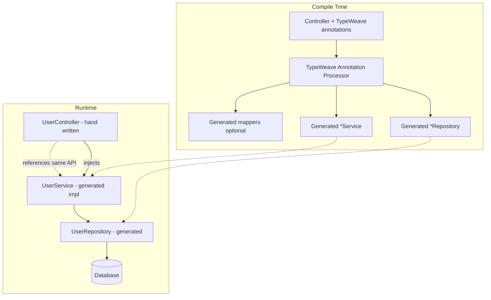
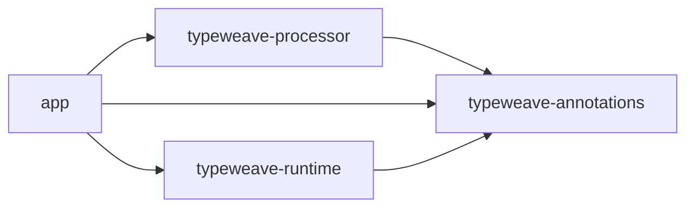

# TypeWeave — Compile-Time Typesafe REST API

**Design specification** for a Spring Boot 4 / Java 25 application that generates repository and service implementations at compile time from declarative controller metadata.

**Source intent:** [thoughts.md](./thoughts.md)

---

## 1. Vision

Developers declare REST endpoints on controllers with rich, type-checked metadata. An annotation processor (APT) reads those declarations and emits:

- JPA (or Spring Data) **repository** interfaces and/or implementations
- **Service** layer methods with lookup, projection, and association loading
- Optional **mapping** glue between entities and response DTOs

**Hand-written** (author-owned): JPA entities, response DTOs (one per shape/graph), and controller shells with annotated method signatures. **Generated**: repository, service, mappers, and fetch/query variants tied to each declared bind key and trail set.

The controller method body remains a thin declaration (or empty stub); behavior is synthesized before the application runs. Incorrect `lookupBy`, missing entities, invalid association paths, or a **trail/DTO mismatch** fail at **compile time**, not in production.

**Codename:** **TypeWeave** — weaving controller contracts into persistence and service layers.

---

## 2. Goals and Non-Goals

### Goals

| ID | Goal |
|----|------|
| G1 | Type-safe entity and field references in annotations (no stringly-typed JPQL in controllers) |
| G2 | Compile-time generation of repository + service methods per endpoint |
| G3 | First-class support for primary lookup and association hints (`alsoGet` / `@Trail`) |
| G4 | **Pagination** on list/read-collection endpoints (page, size, sort) |
| G5 | **Trail-driven response DTOs** — base GET vs `?trail=…` selects different hand-written DTO types at compile time |
| G6 | Spring Boot 4 idioms: constructor injection, `@Transactional` on services, optional virtual threads |
| G7 | Clear, actionable compiler errors (mirror validation-annotation style from prior art in this repo) |

### Non-Goals (v1)

- Runtime bytecode manipulation or Spring AOP-only proxies as the primary mechanism
- Full GraphQL or arbitrary query DSL
- Multi-datasource routing (deferred)
- Generating OpenAPI from annotations (optional later via springdoc)
- A single “god” response DTO that silently changes shape at runtime based on trail (explicit DTO per trail shape instead)

---

## 3. Technology Stack

| Layer | Choice | Notes |
|-------|--------|-------|
| Language | **Java 25** | `--release 25`, preview features only if stabilized in 25 |
| Framework | **Spring Boot 4.0.x** | Servlet stack (Spring MVC) for v1 |
| Persistence | **Spring Data JPA** + Hibernate 7 | Aligns with Boot 4 modular starters |
| Build | **Gradle 9** (Kotlin DSL) | `annotationProcessor` for TypeWeave processor |
| Code generation | **Java Annotation Processing API** | `javax.annotation.processing` / `jakarta` where applicable |
| Boilerplate reduction | **Lombok** (optional) | On hand-written DTOs only; generated code is plain Java |
| API docs | **springdoc-openapi** (optional phase 2) | Documents generated routes |

**Baseline coordinates (illustrative):**

```gradle
java { toolchain { languageVersion = JavaLanguageVersion.of(25) } }
dependencies {
  implementation platform("org.springframework.boot:spring-boot-dependencies:4.0.6")
  implementation "org.springframework.boot:spring-boot-starter-web"
  implementation "org.springframework.boot:spring-boot-starter-data-jpa"
  annotationProcessor project(":typeweave-processor")
}
```

---

## 4. High-Level Architecture



### Module layout

```
typesafe-api/
├── typeweave-annotations/     # @WeaveRead, @WeaveList, @TrailShape, @BindKey, …
├── typeweave-processor/       # APT + code templates (JavaPoet or StringTemplate)
├── typeweave-runtime/         # Small runtime helpers (e.g. FieldRef resolution)
├── app/                       # Spring Boot 4 application (demo + integration tests)
└── docs/
```

---

## 5. Annotation API (Creative Naming)

Annotations use **type-safe field references** via a small `FieldRef<E, V>` (or method reference style) so `lookupBy` and trails are checked by the compiler.

### 5.1 Core annotations

| Annotation | Target | Purpose |
|------------|--------|---------|
| `@WeaveController` | Type | Marks a REST controller participating in TypeWeave |
| `@WeaveRead` | Method | Declares a type-safe GET (single resource) contract |
| `@WeaveList` | Method | Declares a paginated collection GET |
| `@WeaveWrite` | Method | Declares POST/PUT/PATCH/DELETE (phase 2) |
| `@BindKey` | `@WeaveRead` / `@WeaveList` member | Primary lookup field on the entity |
| `@Trail` | Member or repeatable | Association path(s) to load; may be request-driven via query param |
| `@ResponseShape` | `@Trail` or method | DTO class valid for a given trail set (see §5.4) |
| `@DefaultResponse` | `@WeaveRead` member | DTO when no trail (or empty trail) is requested |

### 5.2 Hand-written vs generated

From [thoughts.md](./thoughts.md): entities, DTOs, and controllers are **hand-written**; TypeWeave generates everything below the controller signature.

| Hand-written | Generated |
|--------------|-----------|
| `UserEntity`, `OrderEntity`, … | `{Entity}Repository` (+ fetch variants per trail set) |
| `UserResponseDto`, `UserDetailResponseDto`, … | `{Entity}Service`, `{Entity}ServiceImpl` |
| `UserController` method signatures + annotations | Entity→DTO mappers (MapStruct or TypeWeave stub) |

### 5.3 Example (evolved from thoughts.md)

Original sketch:

```java
// hand-written
class UserEntity { }
class UserDetailResponseDto { }

class UserController {
    @ApiGetMetadata(
        entity = UserEntity.class,
        lookupBy = UserEntity.id,
        alsoGet = { user.order }
    )
    public UserDetailResponseDto getUser(...);
}
```

TypeWeave equivalent — **two response shapes** on the same resource (see §5.4):

```java
// hand-written
@Entity
class UserEntity { /* … */ }

class UserResponseDto { /* scalar fields only */ }
class UserDetailResponseDto { /* includes order graph */ }

@WeaveController
@RestController
@RequestMapping("/api/users")
public class UserController {

    private final UserService userService; // generated interface

    public UserController(UserService userService) {
        this.userService = userService;
    }

    // GET /api/users/{id}  →  UserResponseDto
    @WeaveRead(
        entity = UserEntity.class,
        bindKey = @BindKey(UserEntity_.id),
        defaultResponse = UserResponseDto.class
    )
    @GetMapping("/{id}")
    public UserResponseDto getUser(
            @PathVariable Long id,
            @RequestParam(required = false) String trail) {
        return userService.getUser(id, trail);   // generated overload dispatches by trail
    }

    // Optional: compile-time registry ties trail "user.orders" → UserDetailResponseDto
    // (processor validates; see @TrailShape below)
}
```

Declarative trail → DTO registry on the same endpoint (preferred for compile-time checks):

```java
@WeaveRead(
    entity = UserEntity.class,
    bindKey = @BindKey(UserEntity_.id),
    defaultResponse = UserResponseDto.class,
    shapes = {
        @TrailShape(trail = @Trail(UserEntity_.orders), response = UserDetailResponseDto.class)
    }
)
@GetMapping("/{id}")
public Object getUser(@PathVariable Long id, @RequestParam(required = false) String trail) {
    return userService.getUser(id, trail);
}
```

The processor emits **one service method** that branches on normalized `trail` and returns the type declared for that shape; return type on the controller may be a common supertype or generic wrapper only if all shapes share one (otherwise use separate mapped methods — see §5.4).

**Naming rationale**

- **Weave** — compile-time weaving of layers
- **BindKey** — which column/property binds the HTTP input to the entity (`lookupBy`)
- **Trail** — follow a path through the object graph (replaces `alsoGet`)
- **TrailShape** — binds a trail expression to exactly one response DTO

### 5.4 Trail-driven response DTOs (gotcha)

[thoughts.md](./thoughts.md) requires **separate type-safe response DTOs** per graph shape — not one DTO whose fields appear or disappear at runtime.

| Request | Loaded graph | Response DTO (hand-written) |
|---------|--------------|----------------------------|
| `GET /users/{id}` | Root entity only | `UserResponseDto` |
| `GET /users/{id}?trail=user.orders` | User + orders (`@OneToMany`) | `UserDetailResponseDto` |
| `GET /users/{id}?trail=user.profile` | User + profile (`@ManyToOne`) | e.g. `UserWithProfileResponseDto` |

Rules:

1. **`defaultResponse`** — used when `trail` is absent or empty; must not require associations beyond what the DTO declares.
2. **`@TrailShape`** — each entry lists a canonical trail (metamodel path) and exactly one `response` DTO. The processor verifies every DTO field is satisfiable from entity + that trail’s graph.
3. **Cardinality** — applies equally to `@OneToMany` and `@ManyToOne` (and `@OneToOne`): expanding the graph requires a **different** hand-written DTO type, registered via `@TrailShape`.
4. **Compile-time** — unknown trail string → runtime 400 (validated against allowed set from `shapes`); trail that maps to shape A but controller return type only mentions shape B → **TW007** at compile time.
5. **Repository/service** — processor generates `findById` (no trail) and `findByIdWithOrders` (etc.) per distinct trail shape; service delegates based on normalized trail.

Query parameter format (v1): `trail=user.orders` (dot-separated, matching metamodel path); alias map configurable in `typeweave.trail-aliases`.

### 5.5 Pagination

List endpoints use `@WeaveList` with the same entity/bind/trail/DTO rules as `@WeaveRead`, plus page metadata.

```java
@WeaveList(
    entity = UserEntity.class,
    defaultResponse = UserSummaryResponseDto.class,
    shapes = {
        @TrailShape(trail = @Trail(UserEntity_.orders), response = UserSummaryWithOrdersDto.class)
    },
    pageable = true,
    defaultPageSize = 20,
    maxPageSize = 100,
    sortable = { "id", "createdAt" }
)
@GetMapping
public Page<UserSummaryResponseDto> listUsers(
        @RequestParam(required = false) String trail,
        @ParameterObject Pageable pageable) {
    return userService.listUsers(trail, pageable);
}
```

Generated repository methods use `Pageable` / `Page<T>` (Spring Data). Trail shapes on lists apply fetch joins or batch fetching per global `typeweave.fetch-many` policy. Invalid sort fields → compile-time **TW008** when `sortable` is explicit.

### 5.6 Type-safe field references

Two supported mechanisms (pick one for v1, document the other as v1.1):

1. **JPA Static Metamodel** (`UserEntity_`) — generated by Hibernate JPA Metamodel Generator
2. **`FieldRef` holder** — `FieldRef.of(UserEntity::getId)` using serialized lambda / record-based refs validated at compile time

The processor resolves `BindKey` and `Trail` to:

- JPA attribute names
- Join fetch vs batch size hints
- Generated `findByIdWithOrders` repository method names

---

## 6. Generated Artifacts

For each `@WeaveRead` / `@WeaveList` method, the processor emits artifacts in `target/generated-sources/typeweave/` (package mirrors entity module).

### 6.1 Repository

```java
// Generated: com.example.user.UserRepository
public interface UserRepository extends JpaRepository<UserEntity, Long> {

    @EntityGraph(attributePaths = { "orders" })
    Optional<UserEntity> findWithOrdersById(Long id);
}
```

Naming convention: `{Entity}Repository`, method `{action}{TrailHint}By{BindKeyProperty}`.

### 6.2 Service

```java
// Generated: com.example.user.UserService + UserServiceImpl
public interface UserService {
    Object getUser(Long id, String trail);   // dispatches to shape-specific logic
}

@Service
@Transactional(readOnly = true)
public class UserServiceImpl implements UserService {

    private final UserRepository userRepository;
    private final UserResponseMapper userResponseMapper;
    private final UserDetailResponseMapper userDetailResponseMapper;

    @Override
    public Object getUser(Long id, String trail) {
        if (trail == null || trail.isBlank()) {
            return userRepository.findById(id)
                .map(userResponseMapper::toDto)
                .orElseThrow(() -> new ResourceNotFoundException("User", id));
        }
        if ("user.orders".equals(normalize(trail))) {
            return userRepository.findWithOrdersById(id)
                .map(userDetailResponseMapper::toDto)
                .orElseThrow(() -> new ResourceNotFoundException("User", id));
        }
        throw new InvalidTrailException(trail, Set.of("user.orders"));
    }
}
```

### 6.3 Mapper (optional v1)

- One MapStruct (or generated) mapper per **trail shape**: `UserResponseMapper`, `UserDetailResponseMapper`, etc.
- Map only fields present on each hand-written DTO; processor error if DTO references an association not on the declared trail
- Shared scalar mapping may delegate to a base mapper fragment

### 6.4 Controller wiring

The hand-written controller **must** call the generated service method signature the processor expects. The processor validates:

- Method name alignment (configurable strict vs convention-based)
- Parameter types (`Long id` matches `@BindKey` type)
- `defaultResponse` and each `@TrailShape.response` are distinct hand-written types
- Return type is assignable from the DTO for the implied call (or documented supertype when using trail dispatch)
- List methods use `Page<DTO>` consistent with the shape selected for an empty trail

Mismatch → **compiler error** with element and fix suggestion.

---

## 7. Annotation Processor Design

### 7.1 Processing rounds

1. **Collect** all types annotated with `@WeaveController`
2. For each method with `@WeaveRead` / `@WeaveList` / `@WeaveWrite`:
   - Validate entity class is a JPA `@Entity`
   - Resolve `BindKey` to a persistent attribute
   - Resolve each `Trail` / `@TrailShape` (association must exist, no cycles in v1)
   - Build trail registry: empty trail → `defaultResponse`; each shape → its DTO
   - Validate each DTO only references fields available on its trail graph (incl. `@OneToMany`, `@ManyToOne`)
   - For `@WeaveList`, validate pagination/sort metadata
3. **Emit** repository interface (+ `Page` variants for lists), service interface + impl, mapper stubs per shape
4. **Register** Spring components via `@Generated` + standard stereotypes (processor adds `@Repository` / `@Service` on impl)

### 7.2 Incremental compilation

- Use `RoundEnvironment` and originating elements for all generated types
- Stable type names: `{Entity}Repository`, `{Entity}Service`, `{Entity}ServiceImpl`
- Avoid regenerating unchanged files when possible (optional optimization)

### 7.3 Error catalog (compile-time)

| Code | Condition |
|------|-----------|
| TW001 | `entity` is not a JPA entity |
| TW002 | `BindKey` field not found on entity |
| TW003 | `Trail` path invalid or not an association |
| TW004 | Controller return type does not match `defaultResponse` or `@TrailShape.response` |
| TW005 | Duplicate generated method name for same bind + trails |
| TW006 | Service method invoked from controller does not exist on generated interface |
| TW007 | Trail shape `response` DTO incompatible with entity graph or controller return type |
| TW008 | `@WeaveList` sort field not in `sortable` or invalid pagination config |
| TW009 | Duplicate `@TrailShape` for the same normalized trail on one method |

---

## 8. Runtime Behavior

### 8.1 Transaction boundaries

- Generated service impl: `@Transactional(readOnly = true)` for `@WeaveRead`
- Writes (phase 2): `@Transactional` read-write

### 8.2 Fetch strategy

| Trail cardinality | Default fetch |
|-------------------|---------------|
| `*ToOne` | `JOIN FETCH` in repository `@Query` or `@EntityGraph` |
| `*ToMany` | `@EntityGraph` + `SUBSELECT` or batch size (configurable global default) |

Configuration bean `TypeWeaveProperties` (`typeweave.fetch-many=entity-graph|join|batch`).

### 8.3 Trail query handling (runtime)

1. Parse `trail` query param (if present); normalize to canonical path.
2. Match against allowed shapes from `@TrailShape`; if no match → `400 Bad Request` with allowed trails in problem detail.
3. Select repository fetch variant + mapper for that shape; if absent → `defaultResponse` path (minimal fetch).

### 8.4 Exception mapping

- `ResourceNotFoundException` → HTTP 404 via `@ControllerAdvice` in `typeweave-runtime` (optional starter)
- `InvalidTrailException` → HTTP 400

### 8.5 Virtual threads (Java 25 + Boot 4)

```yaml
spring.threads.virtual.enabled: true
```

No special TypeWeave code required; generated services remain blocking JPA unless Project Loom–aware stack is adopted later.

---

## 9. Spring Boot 4 Application Structure

```
com.example.app
├── Application.java              @SpringBootApplication
├── domain
│   ├── UserEntity.java
│   └── OrderEntity.java
├── api
│   ├── UserController.java       @WeaveController + @WeaveRead
│   └── dto
│       ├── UserResponseDto.java          # default shape
│       └── UserDetailResponseDto.java    # trail=user.orders
└── config
    └── TypeWeaveAutoConfiguration.java   # imports generated packages (if needed)
```

Component scan includes `com.example` and generated sources under the same base package.

---

## 10. Configuration

```yaml
typeweave:
  enabled: true
  base-package: com.example
  generated-suffix:
    repository: Repository
    service: Service
    service-impl: ServiceImpl
  defaults:
    fetch-many: entity-graph
    page-size: 20
    max-page-size: 100
  trail-param: trail          # query param name for graph expansion
  strict-controller: true   # fail if controller body doesn't match expected delegate call
```

---

## 11. Testing Strategy

| Level | Approach |
|-------|----------|
| Processor unit tests | `compile-testing` (Google) with in-memory compilation |
| Golden file tests | Assert emitted Java sources for sample controllers |
| Integration | `@SpringBootTest` + Testcontainers PostgreSQL; hit generated endpoints |
| Regression | TW00x error cases as negative compilation tests |

---

## 12. Security and Observability (v1 baseline)

- Spring Security filter chain unchanged; TypeWeave does not generate security annotations in v1
- Micrometer: optional `@Observed` on generated service methods (phase 2)
- No secrets in generated code; all config via Spring `application.yml`

---

## 13. Implementation Phases

### Phase 1 — Read path MVP

- [ ] `typeweave-annotations` module (`@WeaveRead`, `@BindKey`, `@TrailShape`, `@DefaultResponse`)
- [ ] Trail-driven DTO registry: `GET /users/{id}` vs `?trail=user.orders`
- [ ] Processor: single + multiple `@TrailShape` per method; TW007/TW009
- [ ] Generate repository + service + impl + per-shape mappers
- [ ] Demo app: `UserResponseDto` vs `UserDetailResponseDto` on same endpoint
- [ ] Compile-time error catalog TW001–TW007, TW009

### Phase 2 — Lists, pagination, writes

- [ ] `@WeaveList` with `Pageable`, `sortable`, default/max page size (TW008)
- [ ] `@WeaveWrite` for mutations
- [ ] MapStruct integration for all trail shapes
- [ ] Fetch strategy config for `@OneToMany` / `@ManyToOne` on list endpoints

### Phase 3 — Ergonomics

- [ ] IDE plugin hints (optional)
- [ ] springdoc integration from `@WeaveRead`
- [ ] Native image smoke test with GraalVM 25

---

## 14. Open Decisions

1. **FieldRef vs JPA Metamodel** — recommend JPA Metamodel for v1 (mature tooling with Hibernate 7).
2. **JavaPoet vs Java StringTemplate** — Java 25 StringTemplate for readability; JavaPoet if wider ecosystem fit is preferred.
3. **Controller method bodies** — strict empty stub vs required delegate call (`strict-controller`).
4. **Package of generated sources** — same package as entity vs `.generated` subpackage (recommend `.typeweave.generated` to avoid clutter).

---

## 15. Success Criteria

- Hand-written `UserEntity`, `UserResponseDto`, `UserDetailResponseDto`, and `UserController`; generated repository, service, and mappers.
- `GET /users/{id}` returns `UserResponseDto`; `GET /users/{id}?trail=user.orders` returns `UserDetailResponseDto` with orders loaded — wrong trail → 400.
- A developer adds `@WeaveRead` + `@TrailShape` and receives working repository + service without hand-writing queries for each shape.
- Wrong field reference in `BindKey` or `Trail`, or a DTO that references fields not on the trail graph, fails compilation (TW002, TW003, TW007).
- Paginated `GET /users` with `@WeaveList` returns `Page<>` with configured defaults and validated sort fields.
- Application starts on Spring Boot 4 with Java 25 toolchain and passes integration tests for default and trail-shaped reads.

---

## Appendix A — Mapping from thoughts.md

| thoughts.md | TypeWeave |
|-------------|-----------|
| Hand-written `UserEntity`, DTOs, `UserController` | Unchanged — author-owned types |
| `@ApiGetMetadata` | `@WeaveRead` (+ `@TrailShape` when trail expands graph) |
| `entity = UserEntity.class` | `entity = UserEntity.class` |
| `lookupBy = UserEntity.id` | `bindKey = @BindKey(UserEntity_.id)` |
| `alsoGet = { user.order }` | `@TrailShape(trail = @Trail(UserEntity_.orders), …)` |
| `UserDetailResponseDto` on expanded graph | `@TrailShape(…, response = UserDetailResponseDto.class)` |
| `GET /users/{id}` without trail | `defaultResponse = UserResponseDto.class` |
| Include pagination | `@WeaveList` + `Pageable` / `Page<>` |
| Separate DTO per relation cardinality (`@OneToMany`, `@ManyToOne`) | One `@TrailShape` (and hand-written DTO) per trail; TW007 if DTO ⊄ graph |

---

## Appendix B — Reference dependency graph


