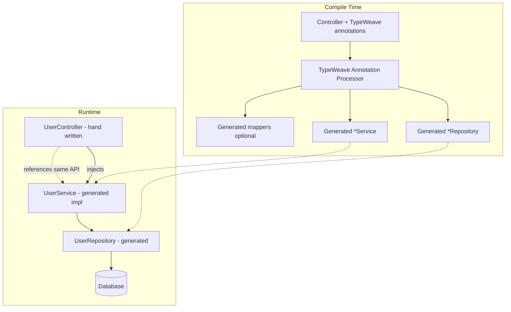
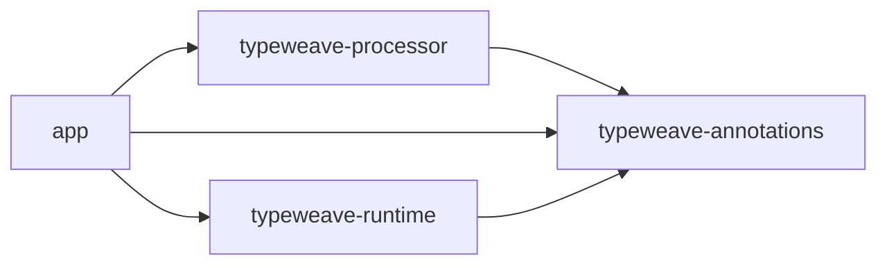

# TypeWeave — Compile-Time Typesafe REST API

**Design specification** for a Spring Boot 4 / Java 25 application that generates repository and service implementations at compile time from declarative controller metadata.

**Source intent:** [thoughts.md](./thoughts.md)

---

## 1. Vision

Developers declare REST endpoints on controllers with rich, type-checked metadata. An annotation processor (APT) reads those declarations and emits:

- JPA (or Spring Data) **repository** interfaces and/or implementations
- **Service** layer methods with lookup, projection, and association loading
- Optional **mapping** glue between entities and response DTOs

The controller method body remains a thin declaration (or empty stub); behavior is synthesized before the application runs. Incorrect `lookupBy`, missing entities, or invalid association paths fail at **compile time**, not in production.

**Codename:** **TypeWeave** — weaving controller contracts into persistence and service layers.

---

## 2. Goals and Non-Goals

### Goals

| ID | Goal |
|----|------|
| G1 | Type-safe entity and field references in annotations (no stringly-typed JPQL in controllers) |
| G2 | Compile-time generation of repository + service methods per endpoint |
| G3 | First-class support for primary lookup and eager/lazy association hints (`alsoGet`) |
| G4 | Spring Boot 4 idioms: constructor injection, `@Transactional` on services, optional virtual threads |
| G5 | Clear, actionable compiler errors (mirror validation-annotation style from prior art in this repo) |

### Non-Goals (v1)

- Runtime bytecode manipulation or Spring AOP-only proxies as the primary mechanism
- Full GraphQL or arbitrary query DSL
- Multi-datasource routing (deferred)
- Generating OpenAPI from annotations (optional later via springdoc)

---

## 3. Technology Stack

| Layer | Choice | Notes |
|-------|--------|-------|
| Language | **Java 25** | `--release 25`, preview features only if stabilized in 25 |
| Framework | **Spring Boot 4.0.x** | Servlet stack (Spring MVC) for v1 |
| Persistence | **Spring Data JPA** + Hibernate 7 | Aligns with Boot 4 modular starters |
| Build | **Gradle 9** (Kotlin DSL) | `annotationProcessor` for TypeWeave processor |
| Code generation | **Java Annotation Processing API** | `javax.annotation.processing` / `jakarta` where applicable |
| Boilerplate reduction | **Lombok** (optional) | On hand-written DTOs only; generated code is plain Java |
| API docs | **springdoc-openapi** (optional phase 2) | Documents generated routes |

**Baseline coordinates (illustrative):**

```gradle
java { toolchain { languageVersion = JavaLanguageVersion.of(25) } }
dependencies {
  implementation platform("org.springframework.boot:spring-boot-dependencies:4.0.6")
  implementation "org.springframework.boot:spring-boot-starter-web"
  implementation "org.springframework.boot:spring-boot-starter-data-jpa"
  annotationProcessor project(":typeweave-processor")
}
```

---

## 4. High-Level Architecture



### Module layout

```
typesafe-api/
├── typeweave-annotations/     # @WeaveRead, @BindKey, @Trail, meta-annotations
├── typeweave-processor/       # APT + code templates (JavaPoet or StringTemplate)
├── typeweave-runtime/         # Small runtime helpers (e.g. FieldRef resolution)
├── app/                       # Spring Boot 4 application (demo + integration tests)
└── docs/
```

---

## 5. Annotation API (Creative Naming)

Annotations use **type-safe field references** via a small `FieldRef<E, V>` (or method reference style) so `lookupBy` and trails are checked by the compiler.

### 5.1 Core annotations

| Annotation | Target | Purpose |
|------------|--------|---------|
| `@WeaveController` | Type | Marks a REST controller participating in TypeWeave |
| `@WeaveRead` | Method | Declares a type-safe GET (or read) endpoint contract |
| `@WeaveWrite` | Method | Declares POST/PUT/PATCH/DELETE (phase 2) |
| `@BindKey` | `@WeaveRead` member | Primary lookup field on the entity |
| `@Trail` | `@WeaveRead` member | Association path(s) to load with the root entity |
| `@ResponseShape` | `@WeaveRead` member | DTO class or projection interface |

### 5.2 Example (evolved from thoughts.md)

```java
@WeaveController
@RestController
@RequestMapping("/api/users")
public class UserController {

    private final UserService userService; // generated interface

    public UserController(UserService userService) {
        this.userService = userService;
    }

    @WeaveRead(
        entity = UserEntity.class,
        bindKey = @BindKey(UserEntity_.id),           // static metamodel or FieldRef
        trail = { @Trail(UserEntity_.orders) },
        response = UserDetailResponseDto.class
    )
    @GetMapping("/{id}")
    public UserDetailResponseDto getUser(@PathVariable Long id) {
        return userService.getUserById(id);           // generated on UserService
    }
}
```

**Naming rationale**

- **Weave** — compile-time weaving of layers
- **BindKey** — which column/property binds the HTTP input to the entity
- **Trail** — follow a path through the object graph (replaces `alsoGet`)

### 5.3 Type-safe field references

Two supported mechanisms (pick one for v1, document the other as v1.1):

1. **JPA Static Metamodel** (`UserEntity_`) — generated by Hibernate JPA Metamodel Generator
2. **`FieldRef` holder** — `FieldRef.of(UserEntity::getId)` using serialized lambda / record-based refs validated at compile time

The processor resolves `BindKey` and `Trail` to:

- JPA attribute names
- Join fetch vs batch size hints
- Generated `findByIdWithOrders` repository method names

---

## 6. Generated Artifacts

For each `@WeaveRead` method, the processor emits artifacts in `target/generated-sources/typeweave/` (package mirrors entity module).

### 6.1 Repository

```java
// Generated: com.example.user.UserRepository
public interface UserRepository extends JpaRepository<UserEntity, Long> {

    @EntityGraph(attributePaths = { "orders" })
    Optional<UserEntity> findWithOrdersById(Long id);
}
```

Naming convention: `{Entity}Repository`, method `{action}{TrailHint}By{BindKeyProperty}`.

### 6.2 Service

```java
// Generated: com.example.user.UserService + UserServiceImpl
public interface UserService {
    UserDetailResponseDto getUserById(Long id);
}

@Service
@Transactional(readOnly = true)
public class UserServiceImpl implements UserService {

    private final UserRepository userRepository;
    private final UserDetailMapper userDetailMapper; // MapStruct or generated mapper

    @Override
    public UserDetailResponseDto getUserById(Long id) {
        UserEntity entity = userRepository.findWithOrdersById(id)
            .orElseThrow(() -> new ResourceNotFoundException("User", id));
        return userDetailMapper.toDetail(entity);
    }
}
```

### 6.3 Mapper (optional v1)

- If `response` DTO is specified, generate or trigger MapStruct `@Mapper` for entity → DTO
- Map only fields present on DTO; trails define which associations are available on the entity graph

### 6.4 Controller wiring

The hand-written controller **must** call the generated service method signature the processor expects. The processor validates:

- Method name alignment (configurable strict vs convention-based)
- Parameter types (`Long id` matches `@BindKey` type)
- Return type matches `@ResponseShape`

Mismatch → **compiler error** with element and fix suggestion.

---

## 7. Annotation Processor Design

### 7.1 Processing rounds

1. **Collect** all types annotated with `@WeaveController`
2. For each method with `@WeaveRead` / `@WeaveWrite`:
   - Validate entity class is a JPA `@Entity`
   - Resolve `BindKey` to a persistent attribute
   - Resolve each `Trail` segment (association must exist, no cycles in v1)
   - Validate response DTO is assignable from a mapping of entity + trails
3. **Emit** repository interface, service interface + impl, mapper stub
4. **Register** Spring components via `@Generated` + standard stereotypes (processor adds `@Repository` / `@Service` on impl)

### 7.2 Incremental compilation

- Use `RoundEnvironment` and originating elements for all generated types
- Stable type names: `{Entity}Repository`, `{Entity}Service`, `{Entity}ServiceImpl`
- Avoid regenerating unchanged files when possible (optional optimization)

### 7.3 Error catalog (compile-time)

| Code | Condition |
|------|-----------|
| TW001 | `entity` is not a JPA entity |
| TW002 | `BindKey` field not found on entity |
| TW003 | `Trail` path invalid or not an association |
| TW004 | Controller return type does not match `response` |
| TW005 | Duplicate generated method name for same bind + trails |
| TW006 | Service method invoked from controller does not exist on generated interface |

---

## 8. Runtime Behavior

### 8.1 Transaction boundaries

- Generated service impl: `@Transactional(readOnly = true)` for `@WeaveRead`
- Writes (phase 2): `@Transactional` read-write

### 8.2 Fetch strategy

| Trail cardinality | Default fetch |
|-------------------|---------------|
| `*ToOne` | `JOIN FETCH` in repository `@Query` or `@EntityGraph` |
| `*ToMany` | `@EntityGraph` + `SUBSELECT` or batch size (configurable global default) |

Configuration bean `TypeWeaveProperties` (`typeweave.fetch-many=entity-graph|join|batch`).

### 8.3 Exception mapping

- `ResourceNotFoundException` → HTTP 404 via `@ControllerAdvice` in `typeweave-runtime` (optional starter)

### 8.4 Virtual threads (Java 25 + Boot 4)

```yaml
spring.threads.virtual.enabled: true
```

No special TypeWeave code required; generated services remain blocking JPA unless Project Loom–aware stack is adopted later.

---

## 9. Spring Boot 4 Application Structure

```
com.example.app
├── Application.java              @SpringBootApplication
├── domain
│   ├── UserEntity.java
│   └── OrderEntity.java
├── api
│   ├── UserController.java       @WeaveController + @WeaveRead
│   └── dto
│       └── UserDetailResponseDto.java
└── config
    └── TypeWeaveAutoConfiguration.java   # imports generated packages (if needed)
```

Component scan includes `com.example` and generated sources under the same base package.

---

## 10. Configuration

```yaml
typeweave:
  enabled: true
  base-package: com.example
  generated-suffix:
    repository: Repository
    service: Service
    service-impl: ServiceImpl
  defaults:
    fetch-many: entity-graph
  strict-controller: true   # fail if controller body doesn't match expected delegate call
```

---

## 11. Testing Strategy

| Level | Approach |
|-------|----------|
| Processor unit tests | `compile-testing` (Google) with in-memory compilation |
| Golden file tests | Assert emitted Java sources for sample controllers |
| Integration | `@SpringBootTest` + Testcontainers PostgreSQL; hit generated endpoints |
| Regression | TW00x error cases as negative compilation tests |

---

## 12. Security and Observability (v1 baseline)

- Spring Security filter chain unchanged; TypeWeave does not generate security annotations in v1
- Micrometer: optional `@Observed` on generated service methods (phase 2)
- No secrets in generated code; all config via Spring `application.yml`

---

## 13. Implementation Phases

### Phase 1 — Read path MVP

- [ ] `typeweave-annotations` module
- [ ] Processor: `@WeaveRead` + `@BindKey` + single `@Trail`
- [ ] Generate repository + service + impl
- [ ] Demo app: User GET by id with orders
- [ ] Compile-time error catalog TW001–TW006

### Phase 2 — Writes and lists

- [ ] `@WeaveWrite`, `@WeaveList` with pagination
- [ ] MapStruct integration for DTO mapping
- [ ] Multiple trails and fetch strategy config

### Phase 3 — Ergonomics

- [ ] IDE plugin hints (optional)
- [ ] springdoc integration from `@WeaveRead`
- [ ] Native image smoke test with GraalVM 25

---

## 14. Open Decisions

1. **FieldRef vs JPA Metamodel** — recommend JPA Metamodel for v1 (mature tooling with Hibernate 7).
2. **JavaPoet vs Java StringTemplate** — Java 25 StringTemplate for readability; JavaPoet if wider ecosystem fit is preferred.
3. **Controller method bodies** — strict empty stub vs required delegate call (`strict-controller`).
4. **Package of generated sources** — same package as entity vs `.generated` subpackage (recommend `.typeweave.generated` to avoid clutter).

---

## 15. Success Criteria

- A developer adds `@WeaveRead` on one controller method and receives working repository + service without hand-writing queries for the declared bind key and trail.
- Wrong field reference in `BindKey` or `Trail` fails compilation with TW002/TW003.
- Application starts on Spring Boot 4 with Java 25 toolchain and passes integration test for the woven endpoint.

---

## Appendix A — Mapping from thoughts.md

| thoughts.md | TypeWeave |
|-------------|-----------|
| `@ApiGetMetadata` | `@WeaveRead` |
| `entity = UserEntity.class` | `entity = UserEntity.class` |
| `lookupBy = UserEntity.id` | `bindKey = @BindKey(UserEntity_.id)` |
| `alsoGet = {user.order}` | `trail = { @Trail(UserEntity_.orders) }` |
| `UserDetailResponseDto` | `response = UserDetailResponseDto.class` |

---

## Appendix B — Reference dependency graph


