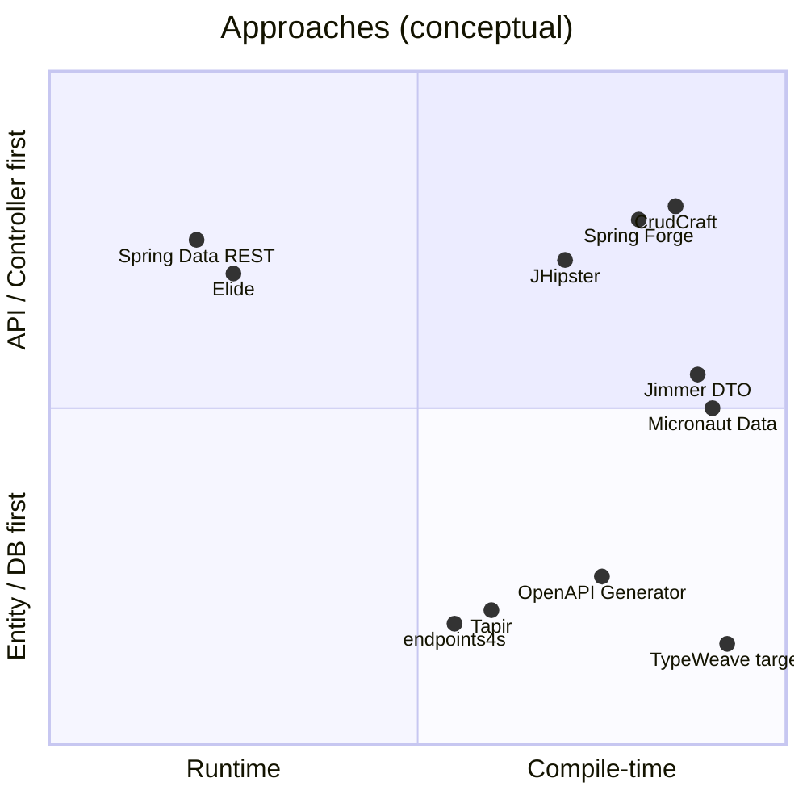

# Similar Frameworks and Tools

A survey of **Java** and **Scala** ecosystems that overlap with the [TypeWeave design](./design-spec.md) goal: reduce REST + persistence boilerplate through **type safety**, **code generation**, or **runtime auto-exposure** of data APIs.

**Related:** [thoughts.md](./thoughts.md) · [design-spec.md](./design-spec.md)

---

## How to read this document

| Dimension | What TypeWeave targets |
|-----------|------------------------|
| **Trigger** | Controller method + metadata (`@WeaveRead`, bind key, trails) |
| **Output** | Repository + service (+ mapper) at **compile time** |
| **Style** | Spring MVC controller stays the “contract”; layers below are woven |

Most tools below differ on at least one axis: they start from **entities**, from an **OpenAPI spec**, or expose **repositories at runtime** without generating Spring services from controller annotations.

---

## At-a-glance comparison

| Project | Language | Primary trigger | Generates / exposes | Compile-time type safety | Spring Boot fit |
|---------|----------|-----------------|---------------------|--------------------------|-----------------|
| **TypeWeave** (this repo) | Java | Controller annotations | Repo, service, mapper | Yes (bind key, trails) | Native (Boot 4 target) |
| [CrudCraft](https://github.com/Data-Steel/CrudCraft) | Java | JPA `@Entity` | Controller, service, repo, DTOs, mappers | Entity-centric | Strong |
| [Spring Forge](https://github.com/kivojenko/spring-forge) | Java | Entity annotations (`@WithJpaRepository`, etc.) | Repo, service, REST controller | APT on entity | Strong |
| [JHipster](https://www.jhipster.tech/) | Java | CLI / JDL / entity wizard | Full stack per entity | JDL/model, not per-endpoint | Strong |
| [Spring Data REST](https://spring.io/projects/spring-data-rest) | Java | `Repository` beans | HTTP resources (runtime) | Repository method names | Strong |
| [Spring Data AOT](https://docs.spring.io/spring-data/commons/reference/data-commons/aot.html) | Java | Spring AOT processing | Repository impl / metadata | Repository layer only | Boot 3.2+ / 4 |
| [Elide](https://elide.io/) | Java | JPA `@Entity` + `@Include` | JSON:API / GraphQL (runtime) | Model annotations | Integrates with Spring |
| [Micronaut Data](https://micronaut-projects.github.io/micronaut-data/latest/guide/) | Java | Repository interfaces | Query implementations (APT) | Repository methods | Via bridge, not native |
| [Quarkus REST Data Panache](https://quarkus.io/guides/rest-data-panache) | Java | Resource interface + Panache | JAX-RS CRUD (build/deploy time) | Interface-driven | Quarkus, not Spring |
| [Jimmer](https://github.com/babyfish-ct/jimmer) | Java/Kotlin | `.dto` files + entities | DTOs, fetchers, TS client | DTO language / graph | Manual REST wiring |
| [Blaze-Persistence](https://persistence.blazebit.com/) | Java | Entity view interfaces | Views, not full REST stack | View attributes | Spring integration |
| [OpenAPI Generator](https://openapi-generator.tech/docs/generators/spring) | Java | OpenAPI YAML/JSON | Controller API + stubs | Spec schema | Strong |
| [Tapir](https://tapir.softwaremill.com/) | Scala | Endpoint descriptions | Server routes, clients, OpenAPI | Endpoint types | Via adapters |
| [endpoints4s](https://endpoints4s.github.io/) | Scala | Algebra of endpoints | Clients, servers, docs | No codegen (pure Scala) | Community adapters |
| [Lagom](https://www.lagomframework.com/) | Scala/Java | Service descriptor API | Clients, gateway, persistence | Descriptor + macros | Different stack |

---

## Java ecosystem

### 1. Entity-driven compile-time CRUD (closest cousins)

These mirror TypeWeave’s “generate service + repository” outcome but usually start from **entities**, not **controller methods**.

#### CrudCraft

- **Site:** [crudcraft.dev](https://www.crudcraft.dev/) · [GitHub](https://github.com/Data-Steel/CrudCraft)
- **Mechanism:** Annotation processor on JPA entities; output under `target/generated-sources/crudcraft`.
- **Generates:** REST controllers (CRUD, search, bulk), services, `JpaRepository` + specifications, DTOs, MapStruct mappers.
- **Overlap with TypeWeave:** Full vertical slice at compile time; Spring Boot starter.
- **Difference:** Entity-first; no declarative `alsoGet` / trail from a specific controller GET. Less suited when each endpoint needs a custom graph and DTO shape.

#### Spring Forge

- **GitHub:** [kivojenko/spring-forge](https://github.com/kivojenko/spring-forge)
- **Mechanism:** APT (`@WithJpaRepository`, `@WithService`, `@WithRestController`, `@WithEndpoints`).
- **Generates:** Repository, service, standard CRUD controller from entity.
- **Overlap:** Compile-time Spring boilerplate removal.
- **Difference:** Newer/smaller ecosystem than CrudCraft; same entity-first model.

#### JHipster

- **Site:** [jhipster.tech](https://www.jhipster.tech/)
- **Mechanism:** CLI / JDL (`jhipster entity`, `jhipster jdl`) — **build-time generator**, not an in-compiler APT tied to arbitrary controller annotations.
- **Generates:** Entity, Liquibase, repository, service, REST controller, tests.
- **Overlap:** End state looks like a generated Spring API.
- **Difference:** One-shot or regenerable scaffold; merging custom code requires [documented patterns](https://www.jhipster.tech/tips/035_tip_combine_generation_and_custom_code.html). Not driven by per-method metadata on an existing controller.

#### spring-data-generator (community)

- **GitHub:** [cmeza20/spring-data-generator](https://github.com/cmeza20/spring-data-generator)
- **Mechanism:** Maven/Gradle plugin generating Spring Data repositories from configuration.
- **Difference:** Repository-focused; does not weave controller → service → association fetch.

---

### 2. Runtime repository → REST (no controller/service codegen)

#### Spring Data REST

- **Docs:** [Spring Data REST](https://docs.spring.io/spring-data/rest/reference/)
- **Mechanism:** At runtime, exposes `CrudRepository` (and related) as HAL/JSON hypermedia resources (e.g. `/orders`, `/orders/{id}`).
- **Overlap:** Eliminates hand-written controllers for standard persistence access.
- **Difference:** No generated **service** layer; HATEOAS-centric API shape; customization via exporters and events, not `@WeaveRead`-style trails on a DTO. Reflection and runtime model (mitigated partly by Spring Data AOT).

#### Elide

- **Site:** [elide.io](https://elide.io/) · [GitHub](https://github.com/yahoo/elide)
- **Mechanism:** JPA-annotated models (`@Include`, relationships) drive **JSON:API** and **GraphQL** at runtime.
- **Overlap:** Type-safe graph fetching (sparse fields, includes) similar in spirit to `alsoGet` / `@Trail`.
- **Difference:** Opinionated wire formats; not Spring MVC annotation weaving; services are implicit in the framework layer.

#### Quarkus REST Data with Panache

- **Guide:** [REST Data Panache](https://quarkus.io/guides/rest-data-panache)
- **Mechanism:** Declare a resource interface; Quarkus generates JAX-RS CRUD from Panache entity/repository.
- **Overlap:** Automatic REST from persistence model.
- **Difference:** Quarkus/Jakarta stack; interface-based generation, not Spring controller metadata.

---

### 3. Compile-time data layer (partial overlap)

These generate **query/repository** code, not full REST + service from controller annotations.

#### Micronaut Data

- **Guide:** [Micronaut Data](https://micronaut-projects.github.io/micronaut-data/latest/guide/)
- **Mechanism:** `micronaut-data-processor` resolves repository methods at compile time; fails compilation if a query cannot be implemented.
- **Overlap:** Compile-time safety, no runtime query parsing for many access patterns.
- **Difference:** Micronaut DI/runtime; does not generate MVC controllers or services from endpoint metadata. Can be used from Spring via guides, but idioms are Micronaut-first.

#### Spring Data Commons AOT

- **Docs:** [AOT optimizations](https://docs.spring.io/spring-data/commons/reference/data-commons/aot.html)
- **Mechanism:** Spring Boot native/AOT pipeline can emit repository implementations and metadata ahead of time.
- **Overlap:** Compile-time repository materialization on Spring Boot 3.2+ / 4.
- **Difference:** Infrastructure optimization, not API design from controller methods.

#### jOOQ

- **Site:** [jooq.org](https://www.jooq.org/)
- **Mechanism:** Codegen from DB schema → type-safe SQL DSL.
- **Overlap:** Strong compile-time typing for data access.
- **Difference:** SQL-centric; REST and service layers remain manual. Often combined with hand-written Spring controllers.

#### Jimmer

- **Site:** [jimmer.org](https://www.jimmer.org/) · [GitHub](https://github.com/babyfish-ct/jimmer)
- **Mechanism:** APT from entity model + **DTO language** (`.dto` files) → immutable DTOs, fetchers, converters; optional TypeScript for clients.
- **Overlap:** Type-safe association fetching and DTO projections (similar problem to `alsoGet` + response DTO).
- **Difference:** ORM + view layer first; REST controllers are application code. No “annotate `UserController.getUser` → generate service” flow.

#### Blaze-Persistence Entity Views

- **Docs:** [Entity Views](https://persistence.blazebit.com/documentation/entity-view/manual/en_US/)
- **Mechanism:** Annotated interfaces define DTO projections; integrated with Spring Data WebMvc/Jackson.
- **Overlap:** Safe graph-shaped reads without manual DTO mapping code.
- **Difference:** Solves fetch/projection, not repository + service + controller generation from one annotation.

---

### 4. Spec-first and CLI generators

#### OpenAPI Generator (Spring)

- **Docs:** [spring generator](https://openapi-generator.tech/docs/generators/spring)
- **Mechanism:** OpenAPI spec → API interfaces, models, optional delegate pattern; `apiFirst` ties spec into compile lifecycle.
- **Overlap:** Generated Spring REST surface.
- **Difference:** Contract-first from HTTP/OpenAPI, not from JPA entity + controller metadata. Association loading is expressed in spec/schemas, not `UserEntity_.orders` trails.

#### Smithy, Swagger Codegen, etc.

- Same category as OpenAPI Generator: excellent for **API-first** teams; orthogonal to entity-centric weaving unless the spec is derived from the domain model separately.

---

## Scala ecosystem

Scala projects often lead on **type-safe endpoint descriptions**; fewer tools generate **JPA repository + Spring-style service** from a single annotation, because the community more often uses functional effect systems (Cats Effect / ZIO) and explicit endpoint algebras.

### Tapir

- **Site:** [tapir.softwaremill.com](https://tapir.softwaremill.com/)
- **Mechanism:** Describe `Endpoint` values (path, query, body, error variants); interpreters for http4s, Pekko HTTP, Play; OpenAPI derivation; optional **OpenAPI → Tapir** sbt codegen.
- **Overlap:** Compile-time correct request/response types; one definition for server, client, and docs.
- **Difference:** Endpoint-first, not “Spring controller + JPA entity → generate repo/service”. Persistence (Doobie, Slick, Quill) is wired manually in server logic.

### endpoints4s

- **Site:** [endpoints4s.github.io](https://endpoints4s.github.io/)
- **Mechanism:** **Algebras + interpreters** — endpoint descriptions are pure Scala values; interpreters produce http4s/Akka/Play servers and clients and OpenAPI.
- **Overlap:** Strong protocol consistency between client and server; compile-time invocation checks.
- **Difference:** Explicitly **no code generation**; no JPA repository weaving. Good reference for API algebra design if TypeWeave ever exposes a fluent Java API in addition to annotations.

### Lagom (Lightbend)

- **Docs:** [Service descriptors](https://www.lagomframework.com/documentation/latest/scala/ServiceDescriptors.html)
- **Mechanism:** `Service` trait defines calls; implementation + `ServiceClient` macro + persistence (Cassandra events) in a microservice framework.
- **Overlap:** Single descriptor drives REST exposure and typed clients.
- **Difference:** Full microservice platform (Play/Akka, Cassandra-oriented persistence), not Spring JPA compile-time codegen.

### Other Scala mentions

| Library | Role | Relation to TypeWeave |
|---------|------|------------------------|
| [http4s](https://http4s.org/) | HTTP server/client | Transport only; pair with Tapir/endpoints4s |
| [Caliban](https://ghostdogpr.github.io/caliban/) | GraphQL | Graph schema codegen/type safety, not REST+JPA weave |
| [Quill](https://getquill.io/) | DB query codegen | Compile-time queries; REST layer separate |
| [Slick](https://scala-slick.org/) | FRM | Typed queries; manual service layer |

---

## Conceptual map

---

## What is still uncommon (TypeWeave niche)

Few projects combine **all** of the following:

1. **Spring MVC controller** as the declaration site (familiar to enterprise teams).
2. **Compile-time** generation of **repository + service** (not only runtime REST exposure).
3. **Type-safe association paths** (trails / `alsoGet`) tied to a **specific response DTO** per endpoint.
4. **Compile errors** when bind keys or trails do not match the entity graph.

The nearest Java neighbors are **CrudCraft** and **Spring Forge** (entity → full stack) and **Jimmer** + **Blaze-Persistence** (type-safe reads/projections without full service codegen). The nearest Scala neighbors are **Tapir** and **endpoints4s** (type-safe HTTP contracts) with persistence left to the application.

---

## References

### Java

- [CrudCraft](https://github.com/Data-Steel/CrudCraft) · [Features](https://www.crudcraft.dev/features.html)
- [Spring Forge](https://github.com/kivojenko/spring-forge)
- [JHipster — Creating an entity](https://www.jhipster.tech/creating-an-entity/)
- [Spring Data REST — Repository resources](https://docs.spring.io/spring-data/rest/reference/repository-resources.html)
- [Spring Data AOT](https://docs.spring.io/spring-data/commons/reference/data-commons/aot.html)
- [Elide — Data models](https://elide.io/pages/guide/v7/02-data-model.html)
- [Micronaut Data guide](https://micronaut-projects.github.io/micronaut-data/latest/guide/)
- [Quarkus REST Data Panache](https://quarkus.io/guides/rest-data-panache)
- [Jimmer documentation](https://babyfish-ct.github.io/jimmer-doc/)
- [Blaze-Persistence Entity Views](https://persistence.blazebit.com/documentation/entity-view/manual/en_US/)
- [OpenAPI Generator — spring](https://openapi-generator.tech/docs/generators/spring)

### Scala

- [Tapir documentation](https://tapir.softwaremill.com/)
- [endpoints4s](https://endpoints4s.github.io/)
- [Lagom — Service descriptors](https://www.lagomframework.com/documentation/latest/scala/ServiceDescriptors.html)

---

*Last updated: May 2026. Versions and maturity of community projects (especially Spring Forge, CrudCraft) should be verified before adoption.*
